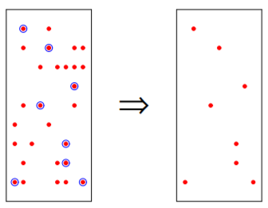
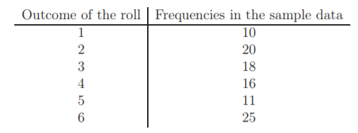
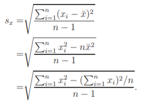
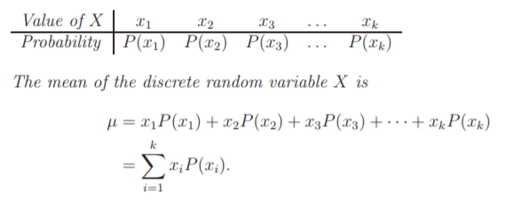
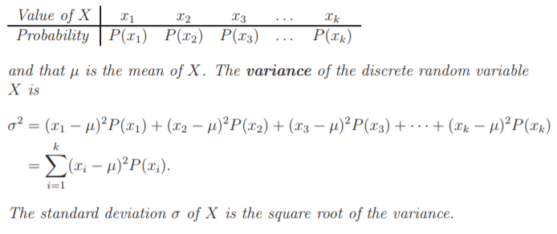
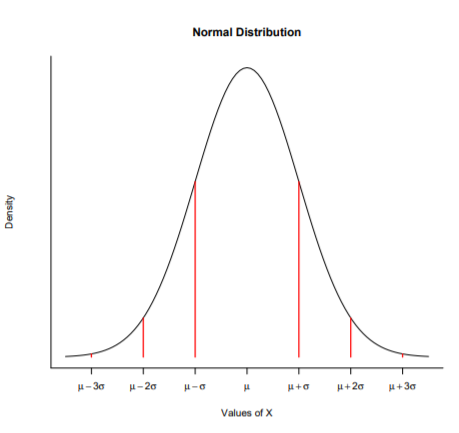

# Statistics

## Population
    Population is the collection of all individuals or items under consideration in a statistical study. (Weiss, 1999)
    Finite Population
    Hypothetical Population

## Sample 
    Sample is that part of the population from which information is collected. (Weiss, 1999)

## Population vs Sample

## Descriptive Statistics
    Descriptive statistics consist of methods for organizing and summarizing information (Weiss, 1999)

## Inferential Statistics 
    Inferential statistics consist of methods for drawing and measuring the reliability of conclusions about population based on  information obtained from a sample of the population. (Weiss, 1999)

Example 1.4 (Descriptive and Inferential Statistics). Consider event of tossing dice. The dice is rolled 100 times and the results are forming the sample data.

    Descriptive statistics is used to grouping the sample data to the following table
    Inferential statistics can now be used to verify whether the dice is a fair or not.

## Variables
    A characteristic that varies from one person or thing to another is called a variable.
    Examples of variables for humans are height, weight, number of siblings, sex, marital status, and eye color.
    
    Discrete variables. Some variables, such as the numbers of children in family, the numbers of car accident on the certain 
    road on different days, orthe numbers of students taking basics of statistics course are the results of counting and thus 
    these are discrete variables.

    Continuous variables. Quantities such as length, weight, or temperature can in principle be measured arbitrarily accurately.

### Measures of Center

## Mode
    Obtain the frequency of each observed value of the variable in a data and note the greatest frequency.
    1. If the greatest frequency is 1 (i.e. no value occurs more than once), then the variable has no mode.
    2. If the greatest frequency is 2 or greater, then any value that occurs with that greatest frequency is called 
    a sample mode of the variable.

## Median 
    Arrange the observed values of variable in a data in increasing order.
    1. If the number of observation is odd, then the sample median is the observed value exactly in the middle of the 
    ordered list.
    2. If the number of observation is even, then the sample median is the number halfway between the two middle 
    observed values in the ordered list.
    In both cases, if we let n denote the number of observations in a data set, then the sample median is at position 
    (n+1)/2 in the ordered list.

## Mean
    The sample mean of the variable is the sum of observed values in a data divided by the number of observations.

1. Mean - Quantitative Variable with Symmetric Distribution
2. Median - Quantitative Variable with Skewed Distribution
3. Mode - Qualitative Variable

## Range
    The sample range of the variable is the difference between its maximum and minimum values in a data set:
    Range = Max − Min.

## Percentile
    Divide the whole sample set into 100 equal parts.

## Decile
    Divide the whole sample set into 10 equal parts.

## Quartile
    Divide the whole sample set into 4 equal parts.
    1. The first quartile Q1 is at position (n+1)/4
    2. The second quartile Q2 (the median) is at position (n+1)/2
    3. The third quartile Q3 is at position 3(n+1)/4
    in the ordered list

    IQR = Q3 − Q1

## Five-number summary and boxplots
    Min, Q1, Q2, Q3, Max.

     To construct a boxplot
    1. Determine the five-number summary
    2. Draw a horizontal (or vertical) axis on which the numbers obtained in step 1 can be located. 
    Above this axis, mark the quartiles and the minimum and maximum with vertical (horizontal) lines.
    3. Connect the quartiles to each other to make a box, and then connect the box to the minimum and maximum with lines.

## Standard Deviation
    Deviation from center

### Random Variable

## Mean

## Standard Deviation

## Normal Distribution - Bell Shaped Distribution
    P(µ − σ < X < µ + σ) = 0.683
    P(µ − 2σ < X < µ + 2σ) = 0.954
    P(µ − 3σ < X < µ + 3σ) = 0.997 

